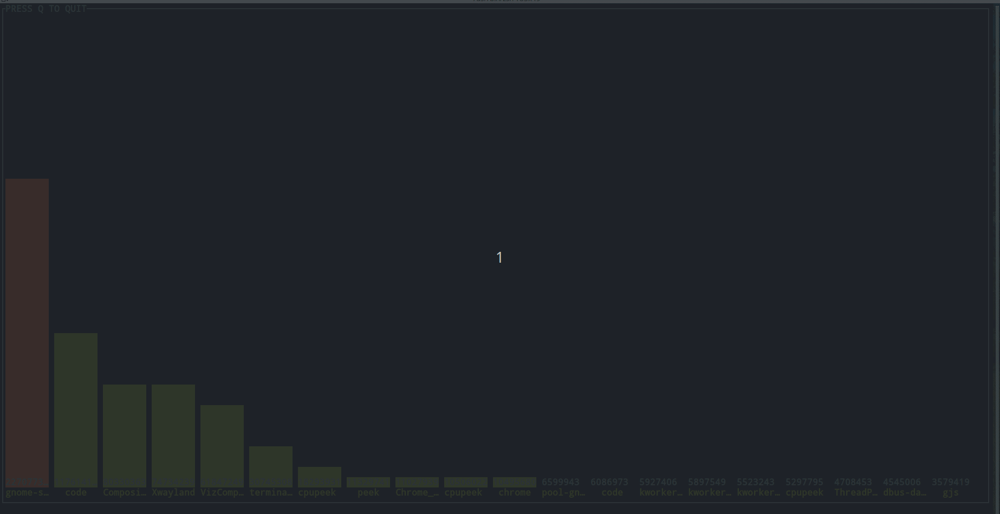
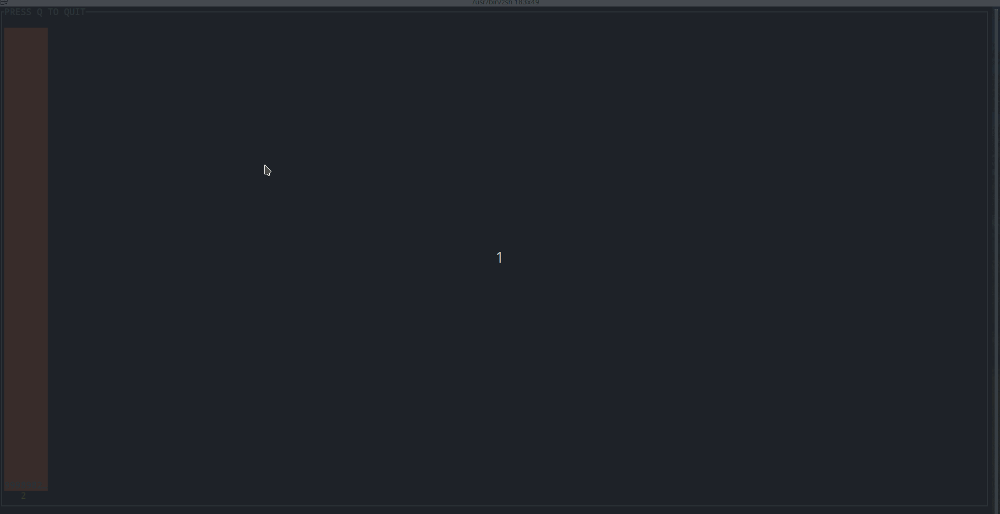

# cpupeek

Gives visual representation of how much CPU processes are using, and other aspects.



Supports two selectors:
- CPU
- PID

That is, we can select a CPU to inspect runtime of each process in it.

or we can chose a process and see what CPUs it gets scheduled on, and how long its been running in each of these CPUs.


By default, all CPUs and all PIDs are selected, and display is grouped by process.

if a `CPU` is selected, display will be grouped by processes.

if a `Process` is selected, display will be grouped by `CPUs` it has been running on.

This app uses `ebpf`.

## Installation

```
wget https://github.com/raghu-nandan-bs/cpupeek/raw/main/release/cpupeek-$(uname -m) -O cpupeek \
 && chmod +x cpupeek
```

## Run

```
sudo ./cpupeek

```


## Options

```
sudo ./cpupeek --help
Usage of ./cpupeek:
  -cpu int
    	cpu to track (default -1)
  -interval duration
    	how often should the screen refresh? (default 1s)
  -log string
    	log file to write to (default "cpupeek.log")
  -pid int
    	pid to track (default -1)
  -show-items int
    	number of items to show in the barchart (default 20)
  -show-pids
    	display process id instead of their names.
  -true-scale
    	scale the barchart to 1s (y axis)
```
